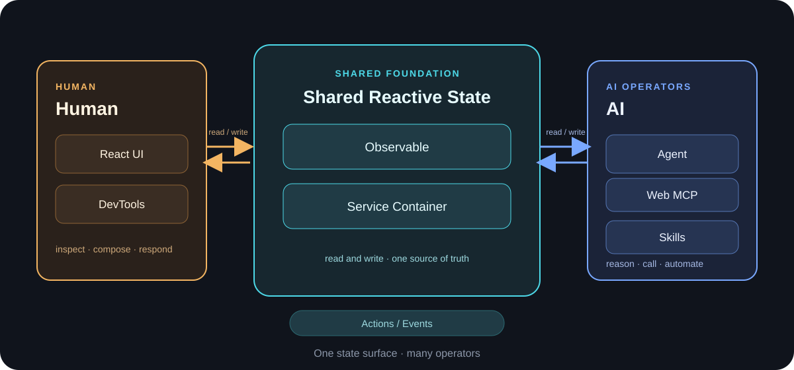

# RAB — AI First 响应式状态架构

[English](./README.md) | [简体中文](./README.zh-CN.md)

> 一种响应式状态架构，让人类与 AI 代理基于同一可观察状态表面协作。



## 为什么选择 RAB

多数状态管理方案为 UI、测试、开发者工具和自动化提供了各自独立的应用理解方式。RAB 则将响应式 Service 状态作为共享契约。无论是用户点击按钮、测试执行断言，还是代理调用工具，都是围绕同一组具名 Service 实例及其可观察状态进行操作。

这减少了重复的客户端、服务端和 UI 状态镜像；让操作可被检查；并为编码代理提供稳定的名称和边界以供推理。因此，AI First 是一种状态契约，而非 AI 专用的 UI 功能。

## 核心架构

RAB 由多个小型层组成，共享同一个状态表面：

- `@rabjs/observer` 跟踪属性依赖，并在这些依赖变化时运行反应。
- `@rabjs/service` 提供可观察的 `Service` 实例、容器、生命周期管理、Action 以及加载和错误状态等方法模型。
- `@rabjs/react` 通过 `observer`、`useService` 和有作用域的服务容器，将 Services 连接到 React。
- DevTools 和 Web MCP 将同一容器及状态表面暴露给检查、断言和代理操作。

最终得到的是一个统一的响应式系统，而不是彼此并列的 UI 状态模型和自动化状态模型。

## 快速开始

在 React 应用中使用 RAB：

```bash
pnpm add @rabjs/react @rabjs/service
```

`@rabjs/react` 会重新导出 observer 和 service API，因此应用通常可以从这一个包导入。可参阅[快速开始文档](https://ximing.github.io/rab/#/quick-start)了解引导式演练。

若要参与此仓库的开发：

```bash
git clone https://github.com/ximing/rab.git
cd rab
pnpm install
```

## 核心包

| 包 | 职责 |
| --- | --- |
| [`@rabjs/observer`](./packages/observer) | 细粒度的可观察依赖跟踪与反应。 |
| [`@rabjs/service`](./packages/service) | 可观察的 Services、依赖容器、生命周期、actions 和方法模型。 |
| [`@rabjs/react`](./packages/react) | 用于响应式渲染和 Service 解析的 React 绑定。 |
| [`@rabjs/devtools`](./packages/devtools) | 对实时容器树的检查和断言访问。 |
| [`@rabjs/web-mcp`](./packages/web-mcp) | 将活动 Services 作为工具暴露给浏览器代理的 WebMCP 桥接器。 |

## AI First 工作流

人类和代理操作通过同一状态契约进入系统。UI 是更新的一个观察者，而不是独立的事实来源：

```text
Human click / Agent tool call
        ↓
Service action or explicit state mutation
        ↓
Observable dependency tracking
        ↓
React UI, DevTools, and assertions observe the same update
```

例如，代理可以发现一个活动的 Service，调用它的某个方法，读取产生的状态，并对结果进行断言。React 会观察完全相同的变更，并且仅重新渲染依赖发生变化的组件。这样既让自动化可被检查，也避免同步额外的面向代理的状态表示。

## Service 示例

这是最小化的 React Service 模式：

```tsx
import { Service, bindServices, observer, useService } from "@rabjs/react";

class CounterService extends Service {
  count = 0;

  increment() {
    this.count += 1;
  }
}

const Counter = observer(() => {
  const counter = useService(CounterService);
  return <button onClick={() => counter.increment()}>{counter.count}</button>;
});

export default bindServices(Counter, [CounterService]);
```

Service 属性默认可观察，Service 方法默认是 Action。此模式无需注册装饰器。`observer` 会记录组件读取的内容，`useService` 则解析当前作用域的实例。`bindServices` 会创建一个支持惰性单例解析的有作用域容器，因此每个绑定的组件树都拥有其注册的 Services，嵌套树则可在需要时解析父级 Services。

## Observer 示例

当响应式状态不依赖 React 时，直接使用 `@rabjs/observer`：

```ts
import { observable, observe, unobserve } from "@rabjs/observer";

const state = observable({ count: 0 });

const reaction = observe(() => {
  console.log(`count: ${state.count}`);
});

state.count += 1; // Runs the reaction because it read state.count.
unobserve(reaction);
```

反应会跟踪它们读取的属性。这些属性发生变化时会重新运行反应；无关变化不会。有关独立 API 和调度选项，请阅读 [Observer 指南](https://ximing.github.io/rab/#/guides/observer)。

## Web MCP 与 DevTools

[`@rabjs/devtools`](./packages/devtools) 暴露实时容器树，供浏览器控制台检查和状态断言使用。它适用于开发者、E2E 检查和基于 CDP 的代理调试，同时不会用快照替换运行时状态。

[`@rabjs/web-mcp`](./packages/web-mcp) 将活动 Service 实例桥接为 WebMCP 工具。浏览器代理可以发现 Services、读取状态、调用方法、进行允许的状态更新并运行断言；这些操作经由与 React 渲染相同的可观察层流动。参阅 [DevTools 指南](https://ximing.github.io/rab/#/guides/devtools)、[AI 概览](https://ximing.github.io/rab/#/ai)和 [Web MCP 指南](https://ximing.github.io/rab/#/ai/web-mcp)。

## 编程 Agent Skills

RAB 在 [`skills/`](./skills) 下提供一组 [Agent Skills](https://code.claude.com/docs/en/claude-code/skills)，教编程 Agent 按 RAB 的正确约定写代码，并调试运行中的应用：

| Skill | 作用 |
| --- | --- |
| [`rab-react`](./skills/rab-react) | 按 `@rabjs/react` 的约定写代码（`observer`、`useService`、`bindServices`、Service 生命周期等）。 |
| [`rab-cdp-debug`](./skills/rab-cdp-debug) | 通过 Chrome DevTools MCP 检查、调用、断言运行中 rab 应用的 Service 实例。 |
| [`rab-rn-debug`](./skills/rab-rn-debug) | 通过 `@rabjs/rn-debug-server` 桥接调试真机上的 React Native 应用。 |

这些 skill 是纯 `SKILL.md` 文档，零运行时依赖，同一份文件可在各个编程工具中通用。各工具安装方式不同——如果同时使用多个工具，请分别为每个工具安装。

### Claude Code

```bash
/plugin marketplace add ximing/rab
/plugin install rab@rab
```

或手动安装：`cp -r skills/rab-react skills/rab-cdp-debug skills/rab-rn-debug ~/.claude/skills/`

### Codex App / Codex CLI

本仓库自身就是一个 Codex 插件市场（见 [`.agents/plugins/marketplace.json`](.agents/plugins/marketplace.json)），无需官方上架：

```bash
codex plugin marketplace add ximing/rab
codex plugin add rab@rab
```

在 Codex App 或 TUI 中，添加市场后也可以打开 `/plugins` 搜索 `rab` 安装。

### Cursor

插件清单在 [`.cursor-plugin/plugin.json`](.cursor-plugin/plugin.json)。在 Cursor Agent 对话框中执行 `/add-plugin rab`，或在插件市场搜索 `rab`。也可以手动把 skill 目录拷贝到项目的 `.cursor/skills/` 下。

### Grok Build CLI

从 xAI 官方插件市场安装（收录审核中：[xai-org/plugin-marketplace#265](https://github.com/xai-org/plugin-marketplace/pull/265)）：

```bash
grok plugin install rab@xai-official --trust
```

### Kimi Code

```text
/plugins install https://github.com/ximing/rab
```

安装后新开会话（`/new`）使插件生效。

### OpenCode

在 `opencode.json`（全局或项目级）中加入插件，它会通过 OpenCode 插件系统注册 `skills/` 目录：

```json
{
  "plugin": ["rab@git+https://github.com/ximing/rab.git"]
}
```

### Pi

```bash
pi install git:github.com/ximing/rab
```

[`package.json`](package.json) 中的包清单为 Pi 的原生 skill 发现声明了 `skills/` 目录。

## 仓库结构

```text
rab/
├── packages/
│   ├── observer/       # @rabjs/observer
│   ├── service/        # @rabjs/service
│   ├── react/          # @rabjs/react
│   ├── devtools/       # @rabjs/devtools
│   └── web-mcp/        # @rabjs/web-mcp
├── examples/           # Runnable examples
├── skills/             # 编程 Agent skills（rab-react、rab-cdp-debug、rab-rn-debug）
├── website/            # Documentation site
├── docs/               # Project documentation and assets
└── configs/            # Shared TypeScript and ESLint configuration
```

## 开发

RAB 是一个由 Turborepo 驱动的 pnpm 工作区。使用以下仓库命令：

```bash
pnpm install
pnpm build
pnpm test:turbo
pnpm --filter @rabjs/website build
```

最后一条命令会独立构建文档站点。开发期间，`pnpm dev` 会启动工作区开发任务。

## 生产构建体积

文档站的生产环境 JavaScript bundle 会由 Vite 进行 minify 压缩。执行生产构建（`pnpm --filter @rabjs/website build`）当前得到：

| 资源 | minify 后大小 | gzip 后大小 |
| --- | ---: | ---: |
| `website/dist/assets/index-*.js` | 448,651 bytes（448.65 kB） | 140,928 bytes（140.93 kB） |

gzip 大小采用 Vite 生产构建输出中的统计值。

## 文档

已发布的文档位于 [ximing.github.io/rab](https://ximing.github.io/rab/)。

- [快速开始](https://ximing.github.io/rab/#/quick-start)
- [Service 容器](https://ximing.github.io/rab/#/guides/service)
- [Observer](https://ximing.github.io/rab/#/guides/observer)
- [实时演示](https://ximing.github.io/rab/#/guides/demos)
- [DevTools](https://ximing.github.io/rab/#/guides/devtools)
- [AI 与 Web MCP](https://ximing.github.io/rab/#/ai/web-mcp)

## 贡献

在提出大型 API 或架构变更前，请先创建 issue 或发起讨论。提交代码时，请创建聚焦的分支，确保 Services 及其公共方法具有清晰名称，为行为变更新增或更新测试，并在创建拉取请求前运行相关构建和测试命令。提交信息请遵循 [Conventional Commits](https://www.conventionalcommits.org/)，并在公开行为变化时更新文档。

## 许可证

RAB 依据 [MIT License](https://opensource.org/license/mit/) 发布。
