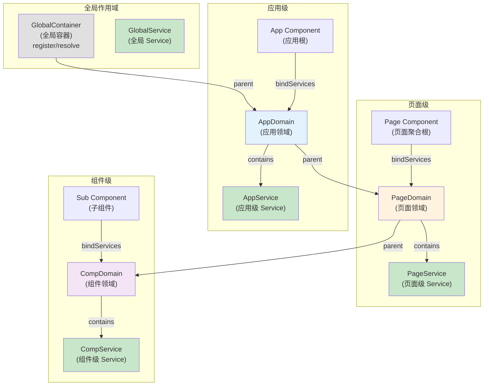
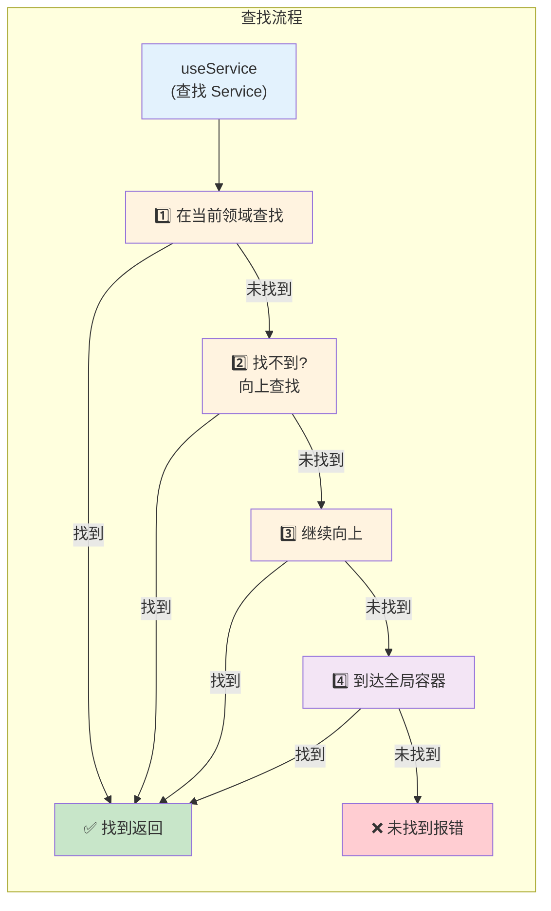
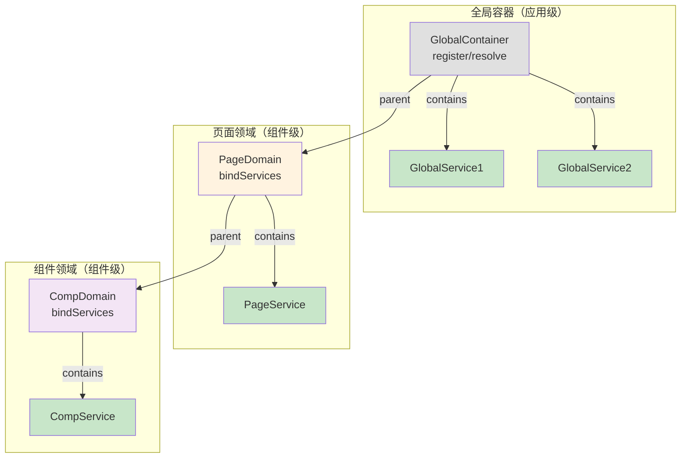
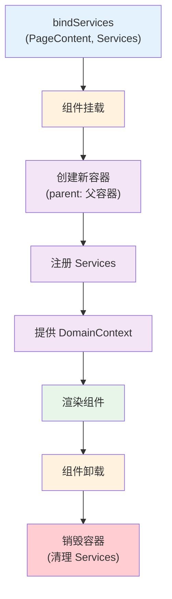

# Service 领域隔离

深入理解 RSJS 的领域（Domain）概念，以及如何通过领域来组织和管理应用状态。

## 什么是 Service 领域？

Service 领域是一个逻辑边界，用于组织相关的 Service 实例。在同一个领域内的组件可以直接访问该领域的 Service，无需层层透传 props。

### 核心特性

- ✅ **聚合根** - 每个领域有一个聚合根组件
- ✅ **作用域链** - 支持嵌套领域，自动向上查找 Service
- ✅ **隔离性** - 不同领域的 Service 相互隔离
- ✅ **简化代码** - 避免 props 层层透传
- ✅ **降低维护成本** - 清晰的状态管理边界

## 领域架构

### 核心概念

**领域（Domain）** 是通过 `bindServices` 创建的一个独立的 Service 容器，与组件的生命周期绑定。当组件挂载时容器创建，当组件卸载时容器销毁。

**全局容器** 通过 `register` 和 `resolve` 管理全局 Service，与应用生命周期绑定。

**作用域链** 当 `useService` 查找 Service 时，先在当前领域查找，找不到则向上查找父领域，直到找到或到达全局容器。

### 基本概念（三级示例）



### 作用域链查找流程



### 全局容器 vs 领域容器



**关键区别：**

| 特性         | 全局容器                 | 领域容器                 |
| ------------ | ------------------------ | ------------------------ |
| **创建方式** | `register()`             | `bindServices()`         |
| **生命周期** | 应用级                   | 组件级                   |
| **创建时机** | 应用启动                 | 组件挂载                 |
| **销毁时机** | 应用关闭                 | 组件卸载                 |
| **用途**     | 全局共享 Service         | 局部隔离 Service         |
| **导入方式** | `from '@rabjs/react'` | `from '@rabjs/react'` |

## 实现原理

### 1. 全局容器 - 应用级管理

全局容器在应用启动时创建，通过 `register` 和 `resolve` 管理全局 Service。

```typescript
import { register, resolve, Service } from '@rabjs/react';

// 定义全局 Service
export class AppService extends Service {
  appName = 'My App';
  theme = 'light';
}

export class LoggerService extends Service {
  log(message: string) {
    console.log(message);
  }
}

// 注册全局 Service（使用全局容器）
register(AppService);
register(LoggerService);

// 解析全局 Service
const appService = resolve(AppService);
const loggerService = resolve(LoggerService);

// 在应用中使用
appService.appName; // 'My App'
loggerService.log('Hello'); // console.log('Hello')
```

**说明：** `register` 和 `resolve` 会自动使用全局容器，无需手动创建或管理容器实例。

### 2. bindServices - 创建领域

`bindServices` 为组件创建一个独立的容器（领域），与组件的生命周期绑定。

```typescript
import { observer, useService, bindServices } from '@rabjs/react';

// 定义页面级 Service
export class PageService extends Service {
  title = '页面标题';
  data: any[] = [];

  async loadData() {
    // 加载数据
  }
}

export class UserService extends Service {
  currentUser: any = null;

  async fetchUser() {
    // 获取用户信息
  }
}

// 页面聚合根组件
const PageContent = observer(() => {
  const pageService = useService(PageService);
  const userService = useService(UserService);

  return (
    <div>
      <h1>{pageService.title}</h1>
      <p>用户: {userService.currentUser?.name}</p>
      <SubComponent />
    </div>
  );
});

// 使用 bindServices 创建领域
// 当 PageContent 挂载时，创建一个新的容器
// 当 PageContent 卸载时，销毁该容器
export default bindServices(PageContent, [PageService, UserService]);
```

**bindServices 的工作流程：**



### 3. DomainContext - 传递容器

`DomainContext` 通过 React Context 将容器传递给子组件。

```typescript
// bindServices 内部实现
<DomainContext.Provider value={container}>
  <PageContent {...props} />
</DomainContext.Provider>
```

### 4. useService - 作用域链查找

`useService` 从当前容器查找 Service，如果找不到则向上查找父容器。

```typescript
// useService 的查找流程
export function useService<T extends Service>(identifier: ServiceIdentifier<T>): T {
  const container = useDomainContext(); // 获取当前容器

  // 1. 先在当前容器查找
  if (container.has(identifier)) {
    return container.resolve(identifier);
  }

  // 2. 如果找不到，自动向上查找（通过 container.parent）
  let parent = container.parent;
  while (parent) {
    if (parent.has(identifier)) {
      return parent.resolve(identifier);
    }
    parent = parent.parent;
  }

  // 3. 直到找到或到达全局容器
  throw new Error(`Service ${identifier} not found`);
}
```

## 使用场景

### 场景 1：页面级领域

```typescript
// 页面级 Service
export class TodoPageService extends Service {
  todos: any[] = [];
  filter: 'all' | 'active' | 'done' = 'all';

  async loadTodos() {
    // 加载待办事项
  }

  addTodo(title: string) {
    this.todos.push({ id: Date.now(), title, done: false });
  }
}

// 页面聚合根
const TodoPageContent = observer(() => {
  const pageService = useService(TodoPageService);

  return (
    <div>
      <h1>待办事项</h1>
      <TodoList />
      <TodoForm />
    </div>
  );
});

export default bindServices(TodoPageContent, [TodoPageService]);

// 子组件 - 无需 props 透传
const TodoList = observer(() => {
  const pageService = useService(TodoPageService);

  return (
    <ul>
      {pageService.todos.map(todo => (
        <li key={todo.id}>{todo.title}</li>
      ))}
    </ul>
  );
});

// 深层子组件 - 仍然可以直接访问
const TodoForm = observer(() => {
  const pageService = useService(TodoPageService);

  return (
    <form
      onSubmit={e => {
        e.preventDefault();
        pageService.addTodo('新任务');
      }}
    >
      <input type="text" />
      <button>添加</button>
    </form>
  );
});
```

### 场景 2：多级嵌套领域

> 💡 **说明**：以下示例展示三级嵌套（全局 → 应用 → 页面 → 组件），但实际可以根据需要创建任意级别的领域。

```typescript
// ========== 全局容器（应用启动时创建）==========
// 使用全局 register 和 resolve 管理全局 Service
import { register, resolve } from '@rabjs/react';

register(AppService);
register(LoggerService);

// ========== 应用级 Service ==========
export class AppService extends Service {
  appName = 'My App';
  theme = 'light';
}

// ========== 页面级 Service ==========
export class PageService extends Service {
  pageTitle = '页面标题';
  pageData: any = null;
}

// ========== 组件级 Service ==========
export class ComponentService extends Service {
  componentState: any = null;
}

// ========== 应用根（第一级 bindServices）==========
const AppContent = observer(() => {
  const appService = useService(AppService); // ✅ 访问全局 Service

  return (
    <div>
      <h1>{appService.appName}</h1>
      <PageComponent />
    </div>
  );
});

export const App = bindServices(AppContent, [AppService]);

// ========== 页面组件（第二级 bindServices）==========
const PageContent = observer(() => {
  const appService = useService(AppService); // ✅ 访问全局 Service
  const pageService = useService(PageService); // ✅ 访问页面级 Service

  return (
    <div>
      <h2>{pageService.pageTitle}</h2>
      <ComponentA />
      <ComponentB />
    </div>
  );
});

export const Page = bindServices(PageContent, [PageService]);

// ========== 组件 A（第三级 bindServices）==========
const ComponentAContent = observer(() => {
  const appService = useService(AppService); // ✅ 访问全局 Service
  const pageService = useService(PageService); // ✅ 访问页面级 Service
  const componentService = useService(ComponentService); // ✅ 访问组件级 Service

  return (
    <div>
      <p>主题: {appService.theme}</p>
      <p>页面: {pageService.pageTitle}</p>
      <p>组件状态: {componentService.componentState}</p>
    </div>
  );
});

export const ComponentA = bindServices(ComponentAContent, [ComponentService]);

// ========== 组件 B（第三级 bindServices，独立领域）==========
const ComponentBContent = observer(() => {
  const appService = useService(AppService); // ✅ 访问全局 Service
  const pageService = useService(PageService); // ✅ 访问页面级 Service
  // ❌ 无法访问 ComponentA 的 ComponentService（不同的领域）

  return (
    <div>
      <p>主题: {appService.theme}</p>
      <p>页面: {pageService.pageTitle}</p>
    </div>
  );
});

export const ComponentB = bindServices(ComponentBContent, [ComponentService]);
```

**关键点：**

- ✅ 每个 `bindServices` 创建一个独立的领域
- ✅ 子领域可以访问父领域的 Service
- ✅ 同级领域相互隔离（ComponentA 和 ComponentB 的 Service 互不可见）
- ✅ 可以创建任意级别的嵌套（不限于三级）

## 最佳实践

### 1. 清晰的领域划分

```typescript
// ✅ 好 - 清晰的领域划分
// 应用级
export class AppService extends Service {
  /* 全局状态 */
}

// 页面级
export class TodoPageService extends Service {
  /* 页面状态 */
}

// 模块级
export class TodoListService extends Service {
  /* 模块状态 */
}

// ❌ 不好 - 混乱的领域划分
export class MixedService extends Service {
  /* 混合各种状态 */
}
```

### 2. 避免过度嵌套

```typescript
// ✅ 好 - 合理的嵌套深度
// App
//   └─ Page
//       └─ Module

// ❌ 不好 - 过度嵌套
// App
//   └─ Page1
//       └─ Module1
//           └─ SubModule1
//               └─ Component1
```

### 3. 使用 Service 依赖注入

```typescript
// ✅ 好 - 使用依赖注入
export class PageService extends Service {
  @Inject(UserService)
  private userService!: UserService;

  async loadPageData() {
    const user = await this.userService.fetchUser();
    // 使用 user 数据
  }
}

// ❌ 不好 - 直接创建依赖
export class PageService extends Service {
  private userService = new UserService();

  async loadPageData() {
    // ...
  }
}
```

### 4. 合理使用 Singleton 和 Transient

```typescript
// ✅ Singleton - 页面级 Service（整个页面共享一个实例）
export class PageService extends Service {
  // 页面级状态
}

// ✅ Transient - 组件级 Service（每个组件实例一个）
export class ComponentService extends Service {
  // 组件级状态
}

// 使用
const Component = observer(() => {
  const pageService = useService(PageService); // Singleton
  const componentService = useService(ComponentService, { scope: ServiceScope.Transient });

  return <div />;
});
```

## 对比：有无领域

### 没有领域（Props 层层透传）

```typescript
// ❌ 需要层层透传 props
function App() {
  const [todos, setTodos] = useState([]);

  return <Page todos={todos} setTodos={setTodos} />;
}

function Page({ todos, setTodos }) {
  return <TodoList todos={todos} setTodos={setTodos} />;
}

function TodoList({ todos, setTodos }) {
  return <TodoItem todos={todos} setTodos={setTodos} />;
}

function TodoItem({ todos, setTodos }) {
  return <div>{todos.length}</div>;
}
```

### 使用领域（直接访问）

```typescript
// ✅ 使用领域，无需 props 透传
export class TodoService extends Service {
  todos: any[] = [];
}

const PageContent = observer(() => {
  return <TodoList />;
});

export const Page = bindServices(PageContent, [TodoService]);

const TodoList = observer(() => {
  const todoService = useService(TodoService);
  return <TodoItem />;
});

const TodoItem = observer(() => {
  const todoService = useService(TodoService);
  return <div>{todoService.todos.length}</div>;
});
```

## 跨领域通信

### 使用全局事件

当需要在不同领域的 Service 之间通信时，可以使用全局事件：

```typescript
// PageA 的 Service（领域 A）
export class PageAService extends Service {
  sendMessage(message: string) {
    // 发送全局事件
    this.emit('app:message', { from: 'PageA', text: message }, 'global');
  }
}

// PageB 的 Service（领域 B）
export class PageBService extends Service {
  receivedMessages: string[] = [];

  constructor() {
    super();

    // 监听全局事件
    this.on(
      'app:message',
      (data: { from: string; text: string }) => {
        this.receivedMessages.push(`${data.from}: ${data.text}`);
      },
      'global'
    );
  }
}

// PageA 组件
const PageAContent = observer(() => {
  const service = useService(PageAService);
  return <button onClick={() => service.sendMessage('Hello from A')}>发送消息</button>;
});

export const PageA = bindServices(PageAContent, [PageAService]);

// PageB 组件
const PageBContent = observer(() => {
  const service = useService(PageBService);
  return (
    <ul>
      {service.receivedMessages.map((msg, i) => (
        <li key={i}>{msg}</li>
      ))}
    </ul>
  );
});

export const PageB = bindServices(PageBContent, [PageBService]);
```

### 容器级别事件 vs 全局事件

```typescript
// 容器级别事件 - 仅在当前领域内有效
export class ServiceA extends Service {
  constructor() {
    super();

    // 监听容器级别事件（默认）
    this.on('local:event', data => {
      console.log('Local event:', data);
    });
  }
}

export class ServiceB extends Service {
  sendLocalEvent() {
    // 只有同一领域内的 ServiceA 能收到
    this.emit('local:event', { message: 'Hello' });
  }
}

// 全局事件 - 跨所有领域
export class ServiceC extends Service {
  constructor() {
    super();

    // 监听全局事件
    this.on(
      'global:event',
      data => {
        console.log('Global event:', data);
      },
      'global'
    );
  }
}

export class ServiceD extends Service {
  sendGlobalEvent() {
    // 所有领域内的 ServiceC 都能收到
    this.emit('global:event', { message: 'Hello' }, 'global');
  }
}
```

### 事件驱动的领域协作

```typescript
// 用户领域
export class UserDomainService extends Service {
  currentUser: any = null;

  login(user: any) {
    this.currentUser = user;
    // 发送全局事件通知其他领域
    this.emit('user:logged-in', user, 'global');
  }

  logout() {
    this.currentUser = null;
    this.emit('user:logged-out', undefined, 'global');
  }
}

// 购物车领域
export class CartDomainService extends Service {
  items: any[] = [];

  constructor() {
    super();

    // 监听用户登录事件
    this.on(
      'user:logged-in',
      (user: any) => {
        this.loadCartForUser(user.id);
      },
      'global'
    );

    // 监听用户登出事件
    this.on(
      'user:logged-out',
      () => {
        this.clearCart();
      },
      'global'
    );
  }

  private async loadCartForUser(userId: number) {
    // 加载用户购物车
  }

  private clearCart() {
    this.items = [];
  }
}

// 通知领域
export class NotificationDomainService extends Service {
  notifications: string[] = [];

  constructor() {
    super();

    // 监听用户登录事件
    this.on(
      'user:logged-in',
      (user: any) => {
        this.notifications.push(`欢迎回来，${user.name}！`);
      },
      'global'
    );

    // 监听用户登出事件
    this.on(
      'user:logged-out',
      () => {
        this.notifications.push('您已安全退出');
      },
      'global'
    );
  }
}
```

## 常见问题

### Q: 如何在不同领域间共享 Service？

A: 有三种方式：

```typescript
// 方式 1：全局 Service
export class GlobalService extends Service {
  /* ... */
}

// 在应用根注册
export const App = bindServices(AppContent, [GlobalService]);

// 在任何子组件中都可以访问
const Component = observer(() => {
  const globalService = useService(GlobalService);
  return <div />;
});

// 方式 2：通过依赖注入
export class PageService extends Service {
  @Inject(GlobalService)
  private globalService!: GlobalService;
}

// 方式 3：使用全局事件通信
export class ServiceA extends Service {
  sendData(data: any) {
    this.emit('shared:data', data, 'global');
  }
}

export class ServiceB extends Service {
  constructor() {
    super();
    this.on(
      'shared:data',
      (data: any) => {
        console.log('Received:', data);
      },
      'global'
    );
  }
}
```

### Q: 容器级别事件和全局事件有什么区别？

A:

| 特性         | 容器级别事件              | 全局事件          |
| ------------ | ------------------------- | ----------------- |
| **作用域**   | 仅在当前容器内            | 跨所有容器        |
| **使用场景** | 同一领域内的 Service 通信 | 跨领域通信        |
| **性能**     | 更好（范围小）            | 稍差（范围大）    |
| **隔离性**   | 强（不同容器隔离）        | 弱（全局共享）    |
| **默认值**   | `scope: 'container'`      | `scope: 'global'` |

```typescript
// 容器级别事件（默认）
this.on('event', handler); // scope: 'container'
this.emit('event', data); // scope: 'container'

// 全局事件
this.on('event', handler, 'global');
this.emit('event', data, 'global');
```

### Q: 如何避免 Service 内存泄漏？

A: `bindServices` 会自动管理容器的生命周期。

```typescript
// ✅ 自动清理
export const Page = bindServices(PageContent, [PageService]);

// 当组件卸载时，容器会自动销毁
// 所有 Service 实例也会被清理
```

### Q: 如何调试领域和 Service？

A: 使用 React DevTools 和浏览器控制台。

```typescript
// 在组件中打印容器信息
const Component = observer(() => {
  const container = useContainer();
  console.log('Container:', container);
  console.log('Services:', container.getStats());

  return <div />;
});
```

## 总结

| 特性             | 优势                |
| ---------------- | ------------------- |
| **聚合根**       | 清晰的状态管理边界  |
| **作用域链**     | 灵活的 Service 查找 |
| **隔离性**       | 不同领域相互独立    |
| **简化代码**     | 避免 props 层层透传 |
| **降低维护成本** | 清晰的代码结构      |

## 下一步

- 🔧 了解 [深入 Service](./service-deep-dive.md)
- 🔍 了解 [observer vs view](./observer-vs-view.md)
- 🌐 查看 [SSR 支持](./ssr.md)
